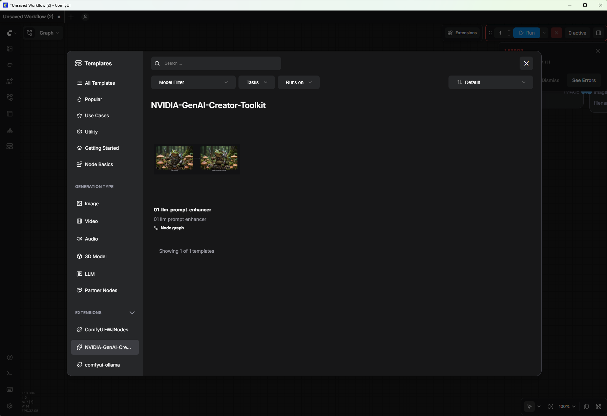
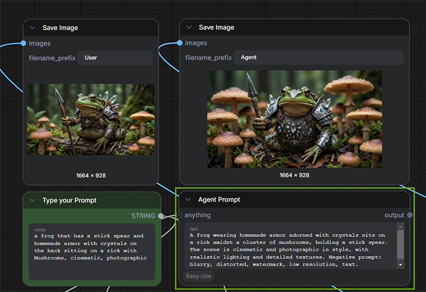

# ComfyUI Generative AI Workflows


**Achieve professional creative control over 3D assets and motion for visualization, powered by modular generative AI pipelines on NVIDIA RTX.**


Adapted from NVIDIA's GTC 2026 DLI course [*Create Generative AI Workflows for Design and Visualization in ComfyUI*](https://www.nvidia.com/en-us/on-demand/session/gtc26-dlit81948/) (DLIT81948). Each module is standalone — pick the pipelines that fit your work.

---

## Requirements

- **GPU:** RTX 5090 (Windows)+ or RTX PRO 6000 (Linux) recommended to run all modules. Not all modules require as much VRAM, see the table below for requirements per module.
- **Disk Space:** 500GB for all modules. See table below for Disk Space requirements per module.
- **OS:** Windows 11 or Linux x86_64
- **CUDA:** 12.x (Windows: included with your NVIDIA driver; Linux: verify with `nvidia-smi`)
- **Python:** 3.10 or newer — 3.11 or 3.12 recommended (Windows Desktop App: bundled; Linux: `python3.12-venv` may be needed, see [LINUX_COMFYUI_INSTALLATION.md](LINUX_COMFYUI_INSTALLATION.md))
- **HuggingFace account:** Required for model downloads. The installer will prompt you to log in. Modules 07 and 08 also require accepting gated model agreements before downloading.
- **Software:** ComfyUI and Git
> **New to ComfyUI?** ComfyUI is a node-based generative AI interface — you connect model components visually to build pipelines. Each workflow in this repo is a pre-built pipeline you load and run.

---

## Quick Start with Module 01
#### Install ComfyUI first (if you haven't already)
##### Windows
Download and install the desktop app from https://www.comfy.org/download.  
Launch ComfyUI and complete its setup. Close ComfyUI when done. 
##### Linux
Download and install ComfyUI for Linux from these step-by-step instructions: [LINUX_COMFYUI_INSTALLATION.md](LINUX_COMFYUI_INSTALLATION.md). 

#### Clone the NVIDIA GenAI Creator Toolkit GitHub Repo
```bash
# Clone this repo
git clone https://github.com/NVIDIA/NVIDIA-GenAI-Creator-Toolkit
cd NVIDIA-GenAI-Creator-Toolkit
```
>Need Git on Windows? Download from git-scm.com/downloads and run the installer.
 
#### Install Module 01
Pass your ComfyUI installation location — the folder you chose during Desktop App setup.  
It contains your .venv\, models\, and custom_nodes\ folders.  
Not sure where it is? Check Desktop App Settings > About > Arguments: --base-directory C:\path\to\your\installation-location

```bash
#Windows
install.bat C:\path\to\your\installation-location --modules 01
#Linux
bash install.sh /path/to/yout/instalation-location --modules 01
```
#### Open and Run Module 01's Workflow in ComfyUI
Start ComfyUI  
Open the Templates window and scroll down to NVIDIA GenAI Creator Toolkit; open module 01.  
  
  

Press the blue run button in ComfyUI and see your prompt improve! 
  
  

> If ComfyUI shows a **Missing Models** dialog, the listed files need to be downloaded before generating. Re-run `install.bat` — already-downloaded models are skipped and only missing files are fetched.

---

## The Modules in this Toolkit

Run the same script again with more module numbers.
```bash
# Windows:
install.bat C:\path\to\ComfyUI --modules 02,03
# Linux:
bash install.sh /path/to/ComfyUI --modules 02,03
```


| # | Workflow | Key Model(s) | Min. Rec. Windows / Linux VRAM | Disk Space | What It Does |
|---|----------|------------|------|--------|-------------|
| 01 | [LLM Prompt Enhancer](workflows/01-llm-prompt-enhancer/) | Gemma 3 via Ollama | 24 / 32 GB | ~65 GB | Build an AI agent that refines weak prompts into model-ready instructions |
| 02 | [Image Deconstruction](workflows/02-image-deconstruction/) | Qwen Image Layered | 24 / 32 GB | ~51 GB | Split any image into foreground, midground, and background layers |
| 03 | [Targeted Inpainting](workflows/03-targeted-inpainting/) | Qwen Image Edit 2511 | 24 / 32 GB | ~52 GB | Mask-and-patch editing — change only the pixels you select |
| 04 | [Image → Gaussian Splat](workflows/04-image-to-gaussian-splat/) | SHARP | 12 / 12 GB | ~3 GB | Convert a 2D image into a navigable 3D Gaussian point cloud |
| 05 | [Novel View Synthesis](workflows/05-novel-view-synthesis/) | Qwen Image Edit 2511 + LoRA | 24 / 32 GB | ~60 GB | Fill occluded areas in Gaussian Splat output for full camera freedom |
| 06 | [Image → Equirectangular](workflows/06-image-to-equirectangular/) | Qwen Image Edit 2511 + MikMumpitz 360 LoRA | 24 / 32 GB | ~61 GB | Turn a single image into a seamless 360° panorama |
| 07 | [Panorama → HDRI](workflows/07-panorama-to-hdri/) | Flux Dev Kontext + Exposure LoRAs | 24 / 32 GB | ~23 GB | Generate a production-ready HDRI from a panoramic image |
| 08 | [Image to 3D](workflows/08-image-to-3d/) | Trellis2 | 24 / 32 GB | ~20 GB | Convert a 2D reference into a textured 3D model with PBR materials |
| 09 | [Image Cut Out Time to Move](workflows/09-image-cut-out-time-to-move/) | Wan2.2 TTM + VideoPrep | 32 / 48 GB | ~77 GB | Trajectory-controlled video — define exactly when and where motion happens |
| 10 | [Video to Video](workflows/10-video-to-video/) | Wan2.2 VACE + Lotus | 32 / 48 GB | ~143 GB | Transform a basic 3D render into stylized video — depth extracted automatically |

### Bonus Modules

| # | Workflow | Key Model(s) | Min. Rec. Windows / Linux VRAM | Disk Space | What It Does |
|---|----------|------------|------|--------|-------------|
| bonus-a | [Texture Extraction](workflows/bonus-a-texture-extraction/) | Qwen Image Edit 2511 + Texture LoRA | 24 / 32 GB | ~60 GB | Extract seamless tileable textures from any image |
| bonus-b | [Texture → PBR](workflows/bonus-b-texture-to-pbr/) | Lotus + Marigold | 24 / 32 GB | ~10 GB | Generate a full PBR material set (Normal, Height, Albedo, Roughness, Metallic) |

> **VRAM — Windows / Linux.** On Windows, NVIDIA weight streaming offloads inactive model layers to system RAM. On Linux, the full model must fit in VRAM. See [LINUX_COMFYUI_INSTALLATION.md](LINUX_COMFYUI_INSTALLATION.md) for platform details.
> **Disk** — Per-module figures assume that module installed alone. Many modules share large models (Qwen 41 GB base, encoders); installing all 12 together costs ~450 GB, not the sum of individual figures.
---

## How Each Module Is Organized

Every module has a folder in [`workflows/`](workflows/) with a README, the ComfyUI JSON, and sample inputs:

```
workflows/01-llm-prompt-enhancer/
├── README.md                     ← usage instructions, models, nodes, troubleshooting
└── 01-llm-prompt-enhancer.json   ← This is the node graph that is visible in ComfyUI. Open it from the Workflow Panel or Template Browser
```

Module 09 includes two workflows — run `09-image-cut-out-time-to-move-videoprep.json` first, then `09-image-cut-out-time-to-move.json`.

---

## Module Dependencies

Some modules build on each other:

```
04 Image → Gaussian Splat
└── 05 Novel View Synthesis

06 Image → Equirectangular
└── 07 Panorama → HDRI

VideoPrep (helper)
└── 09 Image Cut Out Time to Move

Bonus A Texture Extraction
└── Bonus B Texture → PBR
```

All other modules are fully standalone.

---
## Cleanup
To free up disk space, remove a module's model files with `--clean`. Models shared with other installed modules are kept automatically.
```bash
# Windows:
install.bat C:\path\to\ComfyUI --clean --modules 04
# Linux:
bash install.sh /path/to/ComfyUI --clean --modules 04
```

> **What `--clean` removes:** Model files only — custom nodes are left in place. For modules that download a full model repository (e.g. Qwen), the entire model directory is removed. Models shared with other installed modules are automatically kept.
>
> **To restore:** Re-run the installer without `--clean` and already-present nodes are skipped while only the missing models are re-downloaded.
---

## Troubleshooting

See [TROUBLESHOOTING.md](TROUBLESHOOTING.md) for common issues: install errors, missing nodes, VRAM OOM, remote access, and gated model downloads.

---

## License

Code and documentation in this repository are licensed under [Apache 2.0](LICENSE).

Model licenses vary — see each module's README in [`workflows/`](workflows/) for details. Notable exception: **Flux.1-dev** (Module 07) requires a separate license from Black Forest Labs for commercial use.

> **Third-party software notice:** This project will download and install additional third-party open source software projects. Review the license terms of these open source projects before use. See [THIRD-PARTY.txt](THIRD-PARTY.txt) for the full list.

---

## Credits

Course developed by Alessandro La Tona, Ashlee Martino-Tarr, Daniela Flamm Jackson, and Guillaume Polaillon.
