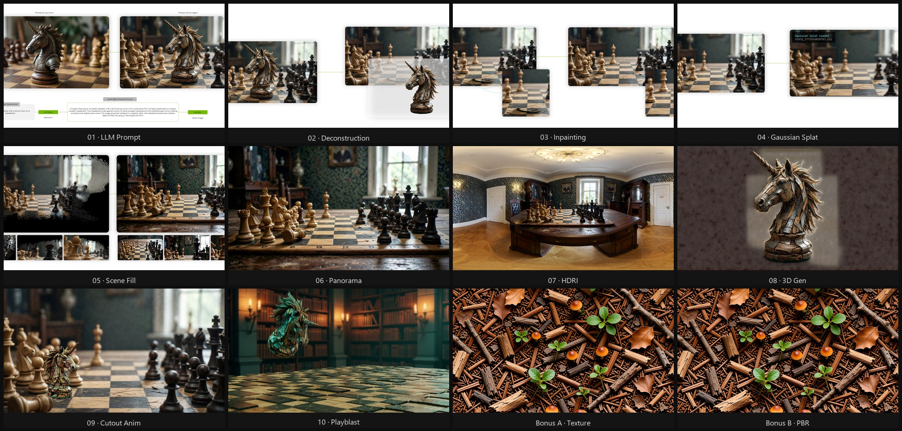

# ComfyUI Generative AI Workflows

**Achieve professional creative control over 3D assets and motion for visualization, powered by modular generative AI pipelines on NVIDIA RTX.**

Adapted from NVIDIA's GTC 2026 DLI course [*Create Generative AI Workflows for Design and Visualization in ComfyUI*](https://www.nvidia.com/en-us/on-demand/session/gtc26-dlit81948/) (DLIT81948). Each module is standalone — pick the pipelines that fit your work.




---

## Requirements

- **GPU:** NVIDIA RTX 30 series or later (16GB+ VRAM recommended)
- **OS:** Windows 11 or Linux x86_64
- **Software:** [ComfyUI](https://github.com/comfyanonymous/ComfyUI) + [ComfyUI Manager](https://github.com/ltdrdata/ComfyUI-Manager)

See [REQUIREMENTS.md](REQUIREMENTS.md) for full details.

---

## Quick Start

> **New to ComfyUI?** Read [REQUIREMENTS.md](REQUIREMENTS.md) first — it covers ComfyUI installation, virtual environment setup, system packages, and Git.

```bash
# 1. Clone this repo
git clone https://github.com/nvidia/comfyui-generative-ai-workflows
cd comfyui-generative-ai-workflows

# 2. Install all custom nodes
#    Run from your ComfyUI root directory, with your Python venv active:
# Windows:
install.bat C:\path\to\ComfyUI
# Linux:
bash install.sh /path/to/ComfyUI

# 3. Download models for the module(s) you want — see each module's models.md

# 4. Open a workflow folder, read its README, then drag workflow.json into ComfyUI
```

---

## Workflows

### Core Modules

| # | Workflow | Key Model(s) | What It Does |
|---|----------|-------------|--------------|
| 01 | [LLM Prompt Enhancer](workflows/01-llm-prompt-enhancer/) | Gemma 3 via Ollama | Build an AI agent that refines weak prompts into model-ready instructions |
| 02 | [Image Deconstruction](workflows/02-image-deconstruction/) | Qwen Image Layered | Split any image into foreground, midground, and background layers |
| 03 | [Targeted Inpainting](workflows/03-targeted-inpainting/) | Qwen Image Edit 2511 | Mask-and-patch editing — change only the pixels you select |
| 04 | [Image → Gaussian Splat](workflows/04-image-to-gaussian-splat/) | SHARP | Convert a 2D image into a navigable 3D Gaussian point cloud |
| 05 | [Gaussian Splat SceneFill](workflows/05-gaussian-splat-scenefill/) | Qwen Image Edit 2511 + LoRA | Fill occluded areas in Gaussian Splat output for full camera freedom |
| 06 | [Image → Equirectangular](workflows/06-equirectangular-outpainting/) | Qwen Image Edit 2511 + MikMumpitz 360 LoRA | Turn a single image into a seamless 360° panorama |
| 07 | [Panorama → HDRI](workflows/07-panorama-to-hdri/) | Flux Dev Kontext + Exposure LoRAs | Generate a production-ready HDRI from a panoramic image |
| 08 | [Trellis2 3D Asset Gen](workflows/08-trellis2-3d-gen/) | Trellis2 | Convert a 2D reference into a textured 3D model with PBR materials |
| 09 | [Cutout Animation → Video](workflows/09-cutout-animation-to-video/) | Wan2.2 TTM + VideoPrep | Trajectory-controlled video — define exactly when and where motion happens |
| 10 | [Playblast → Video](workflows/10-playblast-to-video/) | Wan2.2 VACE + Lotus | Transform a basic 3D render into stylized video — depth extracted automatically |

### Bonus Modules

| | Workflow | Key Model(s) | What It Does |
|--|----------|-------------|--------------|
| B-A | [Texture Extraction](workflows/bonus-a-texture-extraction/) | Qwen Image Edit 2511 + Texture LoRA | Extract seamless tileable textures from any image |
| B-B | [Texture → PBR](workflows/bonus-b-texture-to-pbr/) | Lotus + Marigold | Generate a full PBR material set (Normal, Height, Albedo, Roughness, Metallic) |

---

## How Each Workflow Is Organized

Every module folder contains:

```
workflows/01-llm-prompt-enhancer/
├── README.md       ← what it does, pipeline, usage instructions
├── workflow.json   ← drag this into ComfyUI
├── models.md       ← model names, sizes, download sources
└── nodes.md        ← required custom nodes and install instructions
```

Module 09 includes two workflows — run `videoprep.json` first, then `workflow.json`.

---

## Module Dependencies

Some modules build on each other:

```
04 Image → Gaussian Splat
└── 05 Gaussian Splat SceneFill

06 Image → Equirectangular
└── 07 Panorama → HDRI

VideoPrep (helper)
└── 09 Cutout Animation → Video

Bonus A Texture Extraction
└── Bonus B Texture → PBR
```

All other modules are fully standalone.

---

## Storage Overview

| Module Group | Approx. Storage |
|---|---|
| Modules 01–06, Bonus A (Qwen stack, shared) | ~30 GB |
| Module 07 (Flux Dev Kontext) | ~25 GB |
| Module 08 (Trellis2) | ~20 GB |
| Modules 09–10 (Wan2.2) | ~40 GB |
| Bonus B (Lotus + Marigold) | ~12 GB |
| **All modules (shared models counted once)** | **~160–180 GB** |

You only need to download models for the modules you use.

---

## License

Code and documentation in this repository are licensed under [Apache 2.0](LICENSE).

Model licenses vary — see each module's `models.md` for details. Notable exception: **Flux.1-dev** (Module 07) requires a separate license from Black Forest Labs for commercial use.

---

## Credits

Course developed by Alessandro La Tona, Ashlee Martino-Tarr, and Daniela Flamm Jackson. Workflows by Guillaume Polaillon.
