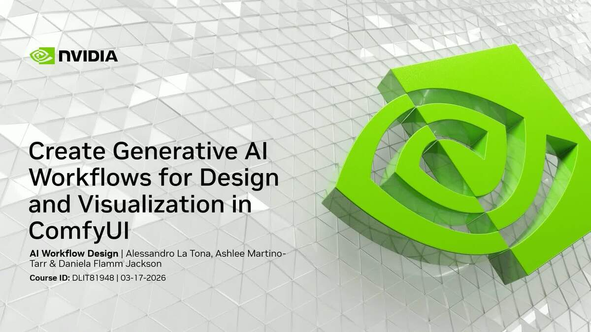

# ComfyUI Generative AI Workflows

**Achieve professional creative control over 3D assets and motion for visualization, powered by modular generative AI pipelines on NVIDIA RTX.**

Adapted from NVIDIA's GTC 2026 DLI course [*Create Generative AI Workflows for Design and Visualization in ComfyUI*](https://www.nvidia.com/en-us/on-demand/session/gtc26-dlit81948/) (DLIT81948). Each module is standalone — pick the pipelines that fit your work.


---

## Requirements

- **GPU:** RTX 3060 (12 GB) minimum for some modules; RTX 4080 (16 GB) for most; RTX 4090 (24 GB) recommended on Windows; RTX 5090 (32 GB) recommended on Linux
  - **Windows** benefits from NVIDIA weight streaming — models larger than available VRAM are streamed from system RAM, so a 4090 handles most modules comfortably
  - **Linux** does not support weight streaming — the full model must fit in VRAM. A 4090 (24 GB) will OOM on modules that run fine on Windows with the same card. RTX 5090 (32 GB) is the practical minimum for Linux; use `--lowvram` as a workaround on 24 GB cards
- **OS:** Windows 11 or Linux x86_64
- **Software:** [ComfyUI](https://github.com/comfyanonymous/ComfyUI) + [ComfyUI Manager](https://github.com/ltdrdata/ComfyUI-Manager)

See [REQUIREMENTS.md](REQUIREMENTS.md) for full details.

---

## Quick Start

> **New to ComfyUI?** ComfyUI is a node-based generative AI interface — you connect model components visually to build pipelines. Think of it like a visual programming tool for AI. Each workflow in this repo is a pre-built pipeline you load and run.

```bash
# 0. Install ComfyUI first (if you haven't already)
#    Windows: download and install from https://www.comfy.org/download
#             (use the desktop app — it handles Python, CUDA, and updates automatically)
#    Linux:   see REQUIREMENTS.md for step-by-step setup
#    Then launch ComfyUI and confirm it opens at http://127.0.0.1:8188

# 1. Clone this repo
git clone https://github.com/NVIDIA/NVIDIA-GenAI-Creator-Toolkit
cd NVIDIA-GenAI-Creator-Toolkit

# 2. Install custom nodes and download models
#    Pass your ComfyUI installation location — the folder you chose during Desktop App setup.
#    It contains your .venv\, models\, and custom_nodes\ folders.
#    Not sure where it is? Check Desktop App Settings > Installation Location.
#
# Windows (run from Command Prompt, NOT Git Bash or PowerShell):
install.bat C:\path\to\your\installation-location
# Linux:
bash install.sh /path/to/ComfyUI

# Portable install — pass the folder containing run_nvidia_gpu.bat:
install.bat C:\ComfyUI_windows_portable
```

> **Finding your installation location:** For the [ComfyUI Desktop App](https://www.comfy.org/download), this is the folder you chose when setting up the app — it contains your `.venv\`, `models\`, and `custom_nodes\` folders. Check **Settings → Installation Location** inside the app if you're unsure. For Portable, pass the folder with `run_nvidia_gpu.bat`. For a manual install, pass the folder with `main.py`.

> **New to this?** Don't download everything at once — see [Recommended Starting Point](REQUIREMENTS.md#recommended-starting-point) in REQUIREMENTS.md for a low-friction first module to try.

### Adding more modules later

Run the same script again with `--modules` and the module number. Already-installed nodes are skipped automatically.

```bash
# Windows:
install.bat C:\path\to\ComfyUI --modules 05
# Linux:
bash install.sh /path/to/ComfyUI --modules 05
```

---

## Workflows

### Core Modules

| # | Workflow | Key Model(s) | What It Does |
|---|----------|-------------|--------------|
| 01 | [LLM Prompt Enhancer](workflows/01-llm-prompt-enhancer/) | Gemma 3 via Ollama | Build an AI agent that refines weak prompts into model-ready instructions |
| 02 | [Image Deconstruction](workflows/02-image-deconstruction/) | Qwen Image Layered | Split any image into foreground, midground, and background layers |
| 03 | [Targeted Inpainting](workflows/03-targeted-inpainting/) | Qwen Image Edit 2511 | Mask-and-patch editing — change only the pixels you select |
| 04 | [Image → Gaussian Splat](workflows/04-image-to-gaussian-splat/) | SHARP | Convert a 2D image into a navigable 3D Gaussian point cloud |
| 05 | [Novel View Synthesis](workflows/05-novel-view-synthesis/) | Qwen Image Edit 2511 + LoRA | Fill occluded areas in Gaussian Splat output for full camera freedom |
| 06 | [Image → Equirectangular](workflows/06-image-to-equirectangular/) | Qwen Image Edit 2511 + MikMumpitz 360 LoRA | Turn a single image into a seamless 360° panorama |
| 07 | [Panorama → HDRI](workflows/07-panorama-to-hdri/) | Flux Dev Kontext + Exposure LoRAs | Generate a production-ready HDRI from a panoramic image |
| 08 | [Image to 3D](workflows/08-image-to-3d/) | Trellis2 | Convert a 2D reference into a textured 3D model with PBR materials |
| 09 | [Image Cut Out Time to Move](workflows/09-image-cut-out-time-to-move/) | Wan2.2 TTM + VideoPrep | Trajectory-controlled video — define exactly when and where motion happens |
| 10 | [Video to Video](workflows/10-video-to-video/) | Wan2.2 VACE + Lotus | Transform a basic 3D render into stylized video — depth extracted automatically |

### Bonus Modules

| | Workflow | Key Model(s) | What It Does |
|--|----------|-------------|--------------|
| B-A | [Texture Extraction](workflows/bonus-a-texture-extraction/) | Qwen Image Edit 2511 + Texture LoRA | Extract seamless tileable textures from any image |
| B-B | [Texture → PBR](workflows/bonus-b-texture-to-pbr/) | Lotus + Marigold | Generate a full PBR material set (Normal, Height, Albedo, Roughness, Metallic) |

---

## How Each Workflow Is Organized

Every module folder contains:

```
workflows/01-llm-prompt-enhancer/
├── README.md                          ← what it does, pipeline, usage instructions
├── 01-llm-prompt-enhancer.json        ← drag this into ComfyUI
├── 01-llm-prompt-enhancer-models.md   ← model names, sizes, download sources
└── 01-llm-prompt-enhancer-nodes.md    ← required custom nodes and install instructions
```

Module 09 includes two workflows — run `09-image-cut-out-time-to-move-videoprep.json` first, then `09-image-cut-out-time-to-move.json`.

---

## Module Dependencies

Some modules build on each other:

```
04 Image → Gaussian Splat
└── 05 Novel View Synthesis

06 Image → Equirectangular
└── 07 Panorama → HDRI

VideoPrep (helper)
└── 09 Image Cut Out Time to Move

Bonus A Texture Extraction
└── Bonus B Texture → PBR
```

All other modules are fully standalone.

---

## Storage Overview

| Module Group | Approx. Storage |
|---|---|
| Modules 01–06, Bonus A (Qwen stack, shared) | ~30 GB |
| Module 07 (Flux Dev Kontext) | ~25 GB |
| Module 08 (Trellis2) | ~20 GB |
| Modules 09–10 (Wan2.2) | ~40 GB |
| Bonus B (Lotus + Marigold) | ~12 GB |
| **All modules (shared models counted once)** | **~160–180 GB** |

You only need to download models for the modules you use.

---

## License

Code and documentation in this repository are licensed under [Apache 2.0](LICENSE).

Model licenses vary — see each module's `[module-name]-models.md` for details. Notable exception: **Flux.1-dev** (Module 07) requires a separate license from Black Forest Labs for commercial use.

> **Third-party software notice:** This project will download and install additional third-party open source software projects. Review the license terms of these open source projects before use. See [THIRD-PARTY.txt](THIRD-PARTY.txt) for the full list.

---

## Credits

Course developed by Alessandro La Tona, Ashlee Martino-Tarr, Daniela Flamm Jackson, and Guillaume Polaillon.
