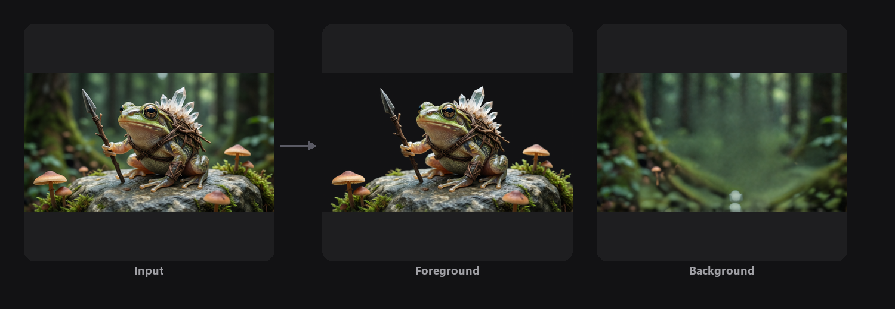

<!-- SPDX-FileCopyrightText: Copyright (c) 2026 NVIDIA CORPORATION & AFFILIATES. All rights reserved. -->
<!-- SPDX-License-Identifier: Apache-2.0 -->

# 02 — Image Deconstruction


## Overview

This workflow explores AI models designed not to create new content, but to break down existing images into meaningful components. Using Qwen Image Layered, you'll deconstruct any image into foreground, middleground, and background elements — reusable building blocks for other workflows and creative pipelines.

## The Problem It Solves

Extracting individual elements from an image is slow and tedious. Traditional methods require isolating assets by hand, repairing the background, and managing multiple layers manually. A deconstruction model automates this entire process, generating clean, ordered layers with alpha and filling in any missing backplate areas.

## Key Features

- **Layered Image Generation:** Produces clean, editable layers for complex compositions.
- **Automatic Background Repair:** Fills gaps left behind when objects are removed.
- **Flexible Layer Count:** Split an image into as many layers as your workflow requires.

## How It Works

```
Image -> Qwen Image Layered -> Multiple Deconstructed Layers
```
## How to Use

1. Open `02-image-deconstruction` from the ComfyUI Template Browswer or Workflow Browser
2. Click **Run**

## Example Output

| Input | Foreground | Background |
|-------|-----------|------------|
|  |  |  |

A sample input image is provided in the `input/` folder.

## Requirements

| Requirement | Value |
|-------------|-------|
| **VRAM Min. Rec. Windows** | 24 GB |
| **VRAM Min. Rec. Linux** | 32 GB |
| **Custom Nodes** | 2 packages |
| **Models** | 4 files |
| **Disk Space** | ~51 GB |

## Required Models

| Model | Type | Size |
|-------|------|------|
| `qwen_2.5_vl_7b_fp8_scaled.safetensors` | Text Encoder | 8.74 GB |
| `qwen_image_layered_vae.safetensors` | VAE | ~255 MB |
| `qwen_image_layered_bf16.safetensors` | Image Model | ~41 GB |
| `Qwen-Image-Edit-2511-Lightning-4steps-V1.0-bf16.safetensors` | LoRA | 810 MB |

## Required Custom Nodes

- [ComfyUI-TextureAlchemy](https://github.com/amtarr/ComfyUI-TextureAlchemy) (Sandbox branch)
- [ComfyUI-WJNodes](https://github.com/807502278/ComfyUI-WJNodes)

## Troubleshooting

### ComfyUI-TextureAlchemy nodes missing or red
Restart ComfyUI after running the installer — nodes are scanned at startup. If nodes still show as red after restart, re-run the installer to ensure ComfyUI-TextureAlchemy is present.

### Output layers look wrong / all black
Ensure FP8 text encoder is loaded when running on 16 GB VRAM. The BF16 encoder requires 24 GB.
