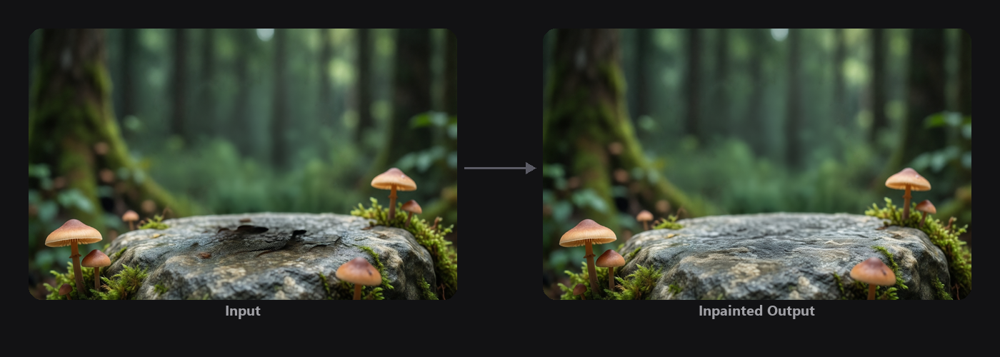
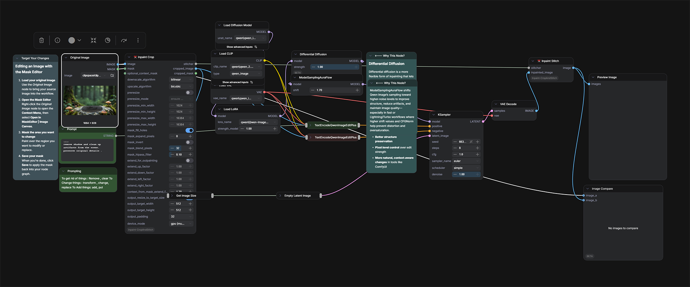

<!-- SPDX-FileCopyrightText: Copyright (c) 2026 NVIDIA CORPORATION & AFFILIATES. All rights reserved. -->
<!-- SPDX-License-Identifier: Apache-2.0 -->

# 03 — Targeted Inpainting


## Overview

Inpainting lets you modify a scene by masking an area and replacing it with new content. While modern text-to-image edit models offer powerful semantic editing, they often alter the entire image even when you only want a small change. This workflow solves that by using a targeted inpaint-patch system that updates only the selected pixels, blending seamlessly back into the original image for production-ready results.

## The Problem It Solves

- **Traditional inpainting provides limited pixel control, often reducing detail.**
- **Text-based image editing can unintentionally shift or alter surrounding areas.**
- **A mask-and-patch approach gives precise control over what changes.**

## Key Features

- **Targeted Inpainting:** Edits only the defined region for maximum accuracy.
- **Cropping and Stitching:** Handles boundaries cleanly and prevents edge artifacts.
- **Qwen-Powered Reconstruction:** Uses Qwen's editing capabilities for clean object removal and seamless fill.

## Going Further

When paired with Qwen Image Edit 2511, this workflow gives precise control over where new objects appear — ideal for set-building, interior design, object placement, and seamless multi-item composition.

## How It Works

```
Input Image -> Mask -> Model Conditioning -> Diffusion -> Output Image
```

## How to Use

1. Open `03-targeted-inpainting` from the ComfyUI Template Browswer or Workflow Browser
2. In the **Load Image** node, right-click the image thumbnail → **Open in MaskEditor**
3. Paint over the area you want to change (white = edit, black = keep)
4. Click **Save** to apply the mask
5. Set your prompt in the text node (e.g. "Clear this area. Seamlessly fill with the environment.")
6. Click **Run**

> **Why does the result look the same?** If no mask is painted, the model has no target area and outputs the original unchanged. Make sure to paint a mask before queuing.

## Sample Input

A sample input image is provided in the `input/` folder.

## Example Output

| Input | Inpainted Output |
|-------|-----------------|
|  |  |


## Understanding the Outputs

The workflow shows two outputs:
- **Preview** — the final result with the inpainted patch stitched back into the original
- **Image Compare** — side-by-side view of the original and the inpainted result

## ComfyUI Canvas



## Requirements

| Requirement | Value |
|-------------|-------|
| **VRAM Min. Rec. Windows** | 24 GB |
| **VRAM Min. Rec. Linux** | 32 GB |
| **Custom Nodes** | 2 packages |
| **Models** | 4 files |
| **Disk Space** | ~52 GB |

## Required Models

| Model | Type | Size |
|-------|------|------|
| `qwen_image_edit_2511_bf16.safetensors` | Image Edit Model | ~41 GB |
| `qwen_2.5_vl_7b_fp8_scaled.safetensors` | Text Encoder | ~9 GB |
| `qwen_image_vae.safetensors` | VAE | ~255 MB |
| `Qwen-Image-Edit-Lightning-8steps-V1.0.safetensors` | LoRA | ~1.7 GB |

## Required Custom Nodes

- [ComfyUI-TextureAlchemy](https://github.com/amtarr/ComfyUI-TextureAlchemy) (branch: `Sandbox`)
- [ComfyUI-Inpaint-CropAndStitch](https://github.com/lquesada/ComfyUI-Inpaint-CropAndStitch)

## Troubleshooting

### Inpainting bleeds outside the mask
Increase mask feather or padding in the CropAndStitch node settings. A small feather (4–8 px) typically produces clean edges.

### ComfyUI-TextureAlchemy nodes missing
Must be the Sandbox branch. See Module 02 troubleshooting.

### Result looks unchanged
Make sure the mask is correctly connected to the inpainting node and the mask is non-zero (white = area to change, black = preserve).
