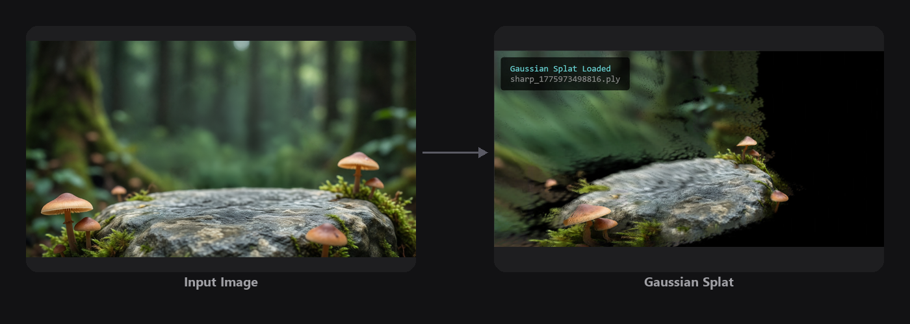
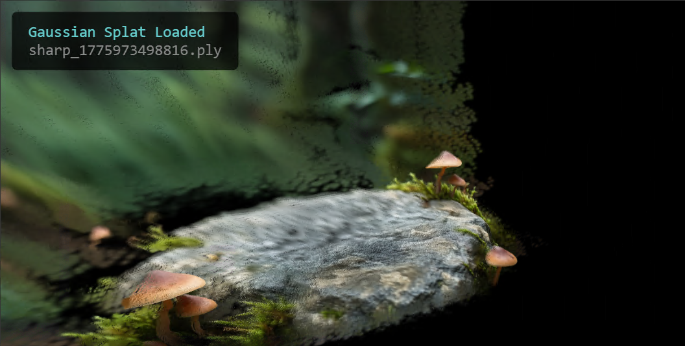
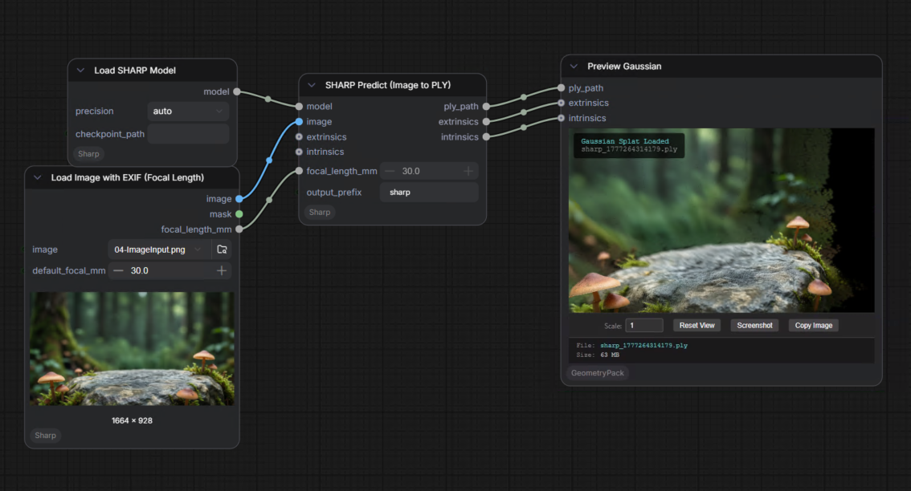

<!-- SPDX-FileCopyrightText: Copyright (c) 2026 NVIDIA CORPORATION & AFFILIATES. All rights reserved. -->
<!-- SPDX-License-Identifier: Apache-2.0 -->

# 04 — Image to Gaussian Splat


## Overview

This workflow uses SHARP, a model capable of inferring molecular-level depth, to generate a 3D Gaussian point cloud from a single image. The result is a navigable 3D representation that lets you explore new angles, depths, and perspectives from what began as a flat 2D reference.

## The Problem It Solves

A single image may capture the right mood, but not the angle or viewpoint you need. Gaussian splatting reconstructs depth and structure, allowing you to explore alternate perspectives faithfully and adding dimensionality to flat references.

## Key Features

- **Gaussian Splatting Integration:** Converts any 2D image into a 3D Gaussian representation.
- **Depth-Aware Reconstruction:** Adds structure and dimensionality to flat images.
- **3D Workflow Compatibility:** Enables mixing 2D references with 3D assets and pipelines.

## How It Works

```
Input -> SHARP -> Gaussian Splat -> 3D Output
```
## How to Use

1. Open `04-image-to-gaussian-splat` from the ComfyUI Template Browser or Workflow Browser
2. Connect your input image and click **Run**

> **If ComfyUI shows a "Missing Node Packs" dialog for `GeomPackPreviewGaussian`:** re-run the installer, then restart ComfyUI.
> ```bash
> # Linux
> bash install.sh /path/to/ComfyUI --modules 04
> # Windows
> install.bat C:\path\to\ComfyUI --modules 04
> ```
> Already-installed nodes are skipped; only the missing viewer dependencies are added.
   
## Sample Input

A sample input image is provided in the `input/` folder.


## Example Output

| Input Image | Gaussian Splat |
|-------------|---------------|
|  |  |


## ComfyUI Canvas



## Requirements

| Requirement | Value |
|-------------|-------|
| **VRAM Min. Rec. Windows** | 12 GB |
| **VRAM Min. Rec. Linux** | 12 GB |
| **Custom Nodes** | 2 packages |
| **Models** | Bundled with ComfyUI-Sharp |
| **Disk Space** | ~3 GB |

## Required Models

The SHARP model (`sharp_2572gikvuh.pt`, ~2.81 GB) downloads automatically when the ComfyUI-Sharp node is installed.

## Required Custom Nodes

Both nodes are installed automatically by the installer. You do not need to install them manually.

- [ComfyUI-Sharp](https://github.com/PozzettiAndrea/ComfyUI-Sharp)
- [ComfyUI-GeometryPack](https://github.com/PozzettiAndrea/ComfyUI-GeometryPack)

## Troubleshooting

### SHARP model not found on first run
ComfyUI-Sharp downloads SHARP automatically when the workflow runs for the first time. Ensure you have an internet connection. The model caches to the node's directory after download.

### GeomPackPreviewGaussian shows as missing on first load
The installer handles this automatically — re-running it is the fastest fix:
```bash
bash install.sh /path/to/ComfyUI --modules 04   # Linux
install.bat C:\path\to\ComfyUI --modules 04     # Windows
```
Then restart ComfyUI. The node should load.

If it still shows as missing after re-running:
1. Open **ComfyUI Manager** → **Install Missing Custom Nodes**
2. Search for **ComfyUI-GeometryPack** and reinstall
3. Restart ComfyUI

### Gaussian Splat viewer not opening
The 3D viewer requires WebGL. Use a Chromium-based browser (Chrome, Edge). Firefox may require enabling WebGL flags.

### Point cloud is noisy / incorrect geometry
SHARP performs best on images with clear subject-background separation. Crop tightly to the subject and avoid complex backgrounds.
