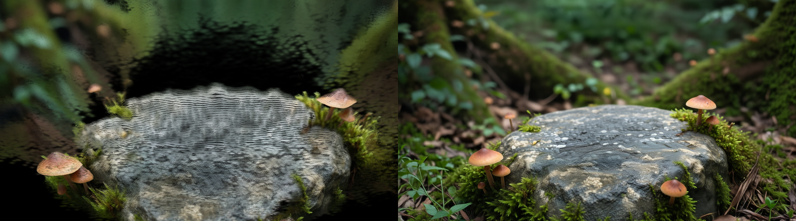

# Module 05 — Gaussian Splat SceneFill

Reconstruct the missing areas in a Gaussian Splat so you can freely move the camera.

---

## What It Does

When you convert a single image into a Gaussian Splat (Module 04), new camera angles reveal areas with no data — occluded surfaces, foliage edges, anything behind the subject. Standard diffusion models can't fill these areas coherently because they don't understand 3D scene structure.

This workflow uses a LoRA specifically trained for Gaussian Splat scene fill. It reconstructs the hidden areas with spatial consistency, producing a complete scene you can reframe and zoom without visible gaps.

**Pipeline**

```
Gaussian Splat output (from Module 04)
    └── Qwen Image Edit 2511 + SceneFill LoRA
            └── Diffusion
                    └── Completed scene image
```

---

## Why a LoRA?

This module demonstrates a key concept: LoRAs let you extend what a base model can do for tasks that require specialized knowledge. Filling occluded 3D areas is one of those tasks — it requires understanding depth, spatial consistency, and the 3D context behind the original image. The SceneFill LoRA is trained for exactly that.

---

## Tips for Best Results

- **Identify the gap regions before you run.** Open your Module 04 .ply in Supersplat and orbit the camera to the extreme angles — look for where geometry disappears or the background shows through. Knowing exactly which directions have missing data helps you evaluate whether the SceneFill output actually solved the problem.
- **The fill is a completed scene image, not a new splat.** The output of this module is a diffusion-generated image of what the full scene should look like, not a second .ply file. Think of it as a reference for what content should appear in the occluded areas — it feeds back into the 3D pipeline, so its spatial plausibility matters more than its photorealism.
- **Your source image composition directly affects fill quality.** If the original photo had very little background visible (tight crop, large subject), the model has almost nothing to extrapolate from. SceneFill performs best when the original image shows enough environmental context to suggest what should be in the occluded areas.
- **Prompt the scene type explicitly if the fill looks generic.** The LoRA understands 3D spatial context, but adding a descriptive prompt — "forest floor," "concrete urban alley," "sunlit office interior" — steers the base model toward coherent fill content rather than an averaged guess.
- **If fill edges look inconsistent, check the mask coverage.** Incomplete or feathered masks can cause the fill to partially overwrite good geometry. Examine the mask being passed to the inpainting step and make sure it tightly covers only the genuinely missing regions.
- **Run the Lightning LoRA at 8 steps, but increase steps for final output.** The 8-step Lightning LoRA is fast for iteration, but for a fill that will be used in production or composited back into a scene, running more steps (20–30) with the standard scheduler can improve spatial coherence and edge quality.
- **Overlap and blending matter at the fill boundary.** The most visible failure mode is a hard transition between original splat content and filled content. If you see this, increase the overlap/feather parameters on the inpainting crop — a wider blend zone gives the model more context to match tone and detail.
- **Iterate with different seeds before tuning parameters.** Seed variation alone often produces dramatically different fill results for the same parameters. Try 3–5 seeds before deciding a parameter needs changing.
- **Expect soft or stylized fill in complex occlusions.** Highly occluded areas — like the back of a chair, the underside of a ledge, or deep foliage shadow — give the model very little geometric signal. The fill there will be plausible but not precise. Budget for this when planning downstream use.

---

## Models

See [models.md](models.md) — total storage ~29 GB

| Model | Size |
|-------|------|
| Qwen Image Edit 2511 BF16 | 13.5 GB |
| Qwen 2.5 VL 7B Text Encoder | 14.5 GB |
| Qwen Image VAE | 170 MB |
| Qwen Sharp Gaussian Splat LoRA | 500 MB |
| Qwen Lightning 8-step LoRA | 500 MB |

> If you ran Module 04, the SHARP model is already installed. This module adds only the SceneFill LoRA on top.

---

## Requirements

- VRAM: 12–16 GB
- Recommended: Run Module 04 first to generate the Gaussian Splat input

---

## Custom Nodes

See [nodes.md](nodes.md)

| Node Pack | Key Nodes |
|-----------|-----------|
| [ComfyUI-Sharp](https://github.com/PozzettiAndrea/ComfyUI-Sharp) | `LoadImageWithExif`, `SharpPredict` |
| [ComfyUI-GeometryPack](https://github.com/PozzettiAndrea/ComfyUI-GeometryPack) | `GeomPackPreviewGaussian` |

---

## Usage

1. Complete Module 04 to generate a Gaussian Splat
2. Install custom nodes via ComfyUI Manager (same as Module 04)
3. Download the SceneFill LoRA (see [models.md](models.md))
4. Drag `workflow.json` into ComfyUI
5. Queue
