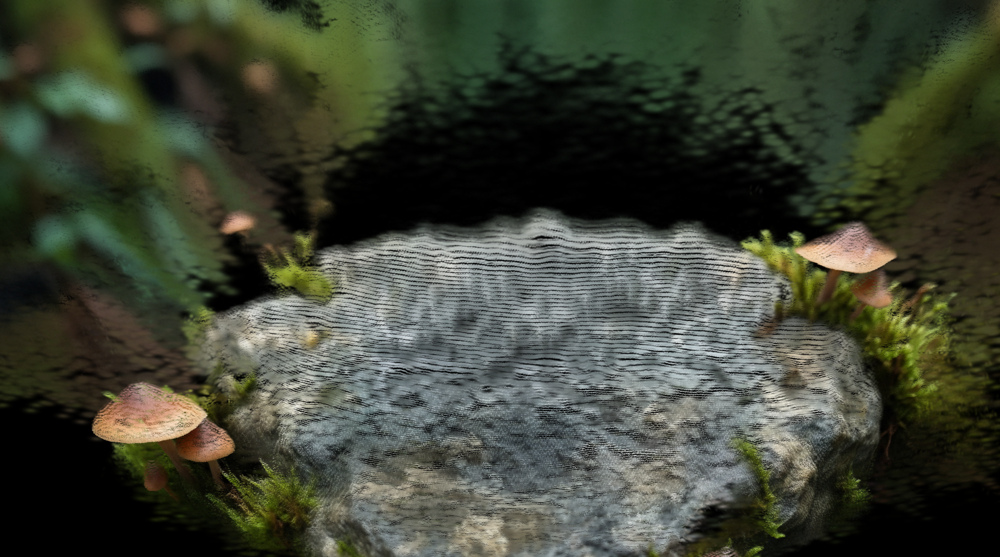

<!-- SPDX-FileCopyrightText: Copyright (c) 2026 NVIDIA CORPORATION & AFFILIATES. All rights reserved. -->
<!-- SPDX-License-Identifier: Apache-2.0 -->

# 05 — Gaussian Splat SceneFill


## Overview

This workflow uses a LoRA to fill in the missing visual information that appears when converting a single image into a Gaussian Splat. The LoRA helps reconstruct the hidden parts of the scene, giving you fully usable camera angles from any position.

## The Problem It Solves

Standard diffusion models struggle with coherent scene structure. Gaussian splatting reconstructs 3D structure, but to make the output truly usable you need LoRAs trained to fill in missing areas such as foliage or occluded objects. This workflow bridges that gap.

## Key Features

- **Scene-Aware Generation:** Creates images with stronger depth, structure, and spatial context.
- **LoRA Integration:** Fills in low-visibility areas base models struggle with.
- **Enhanced Camera Flexibility:** Produces complete scenes that support meaningful camera movement.

## How It Works

```
Input Image -> LoRA -> Diffusion Process -> Output
```
## How to Use

1. Complete [Module 04](../04-image-to-gaussian-splat/) first to generate your Gaussian Splat output
2. Open `05-novel-view-synthesis` from the ComfyUI Template Browswer or Workflow Browser
3. Connect your splat output and click **Run**
   
## Sample Input

Sample input images are provided in the `input/` folder.

## Example Output

| Input Splat | Filled Output |
|-------------|---------------|
|  |  |


## Requirements

| Requirement | Value |
|-------------|-------|
| **VRAM Min. Rec. Windows** | 24 GB |
| **VRAM Min. Rec. Linux** | 32 GB |
| **Custom Nodes** | 1 package |
| **Models** | 5 files |
| **Disk Space** | ~60 GB |

## Required Models

| Model | Type | Size |
|-------|------|------|
| `qwen_image_edit_2511_bf16.safetensors` | Image Model | ~41 GB |
| `qwen_2.5_vl_7b.safetensors` | Text Encoder | ~17 GB |
| `qwen_image_vae.safetensors` | VAE | ~255 MB |
| `Qwen-Image-Lightning-8steps-V2.0.safetensors` | LoRA | ~1.7 GB |
| `Qwen2511SharpGuassianSplat.safetensors` | LoRA | 225 MB |

## Required Custom Nodes

- [ComfyUI-Sharp](https://github.com/PozzettiAndrea/ComfyUI-Sharp)
- 
## Troubleshooting

### Safetensors or LoRA dropdown is empty
ComfyUI only scans for model files at startup. Restart ComfyUI after running the installer and the files will appear in all dropdowns.

### Gaussian Splat LoRA not loading
The LoRA file has a Chinese filename in the source repo (`高斯泼溅-Sharp.safetensors`) and is renamed to `Qwen2511SharpGaussianSplat.safetensors` by the downloader. If you downloaded manually, rename the file accordingly.

### Run Module 04 first
This module builds on the Gaussian Splat output from Module 04. Run Module 04 first and use its output as input here.

### Occlusion filling has artifacts
Increase sampler steps or try a different seed. Novel view synthesis is sensitive to the camera angle — stay within ±30° of the original view for best results.
