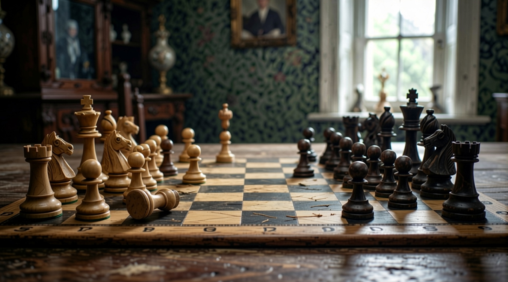

# Module 06 — Image to Seamless Equirectangular Panorama

Turn a single image into a seamless 360° equirectangular panorama ready for spherical mapping.

---

## What It Does

Creating a correct equirectangular panorama from a single image isn't just outpainting — the projection geometry has to be right or the image won't wrap seamlessly onto a sphere. This workflow combines a specialized 360° LoRA with outpainting and targeted inpainting to extend the image in all directions and then remove any visible seams.

**Pipeline**

```
Input Image
    └── Pad canvas for outpainting
            └── MikMumpitz 360 LoRA + Diffusion (outpaint)
                    └── Targeted inpainting (seam removal)
                            └── Seamless 2:1 equirectangular output
```

---

## Output

A 2:1 ratio equirectangular image (.png) ready for:

- **Module 07** — Convert to a full HDRI for 3D lighting
- Unreal Engine, Blender, Unity — as a 360° backdrop or skybox
- Spherical video backgrounds

---

## Tips for Best Results

- **Start with a landscape-oriented image, ideally 16:9 or wider.** The workflow has to invent the most content for images that cover the smallest angular range. A landscape photo already shows a wide horizontal slice of the scene, so the model only needs to extend vertically and wrap the poles — less invented content means fewer coherence problems.
- **Avoid images with strong perspective convergence at the edges.** If your source image has hard architectural lines (hallways, corridors, grid ceilings) that visibly converge toward the frame edges, they are difficult to extend without creating warped-looking geometry in the outpainted regions. Organic environments — nature, open spaces, loosely-structured interiors — extend far more naturally.
- **Check the seam area explicitly before delivering.** After the seam removal inpainting step, shift the image horizontally by 50% (the `TextureOffset` node does this) and look at what was the seam boundary. Seam artifacts — brightness discontinuities, blurry patches, repeated texture — are easiest to spot this way. If you see them, re-run the seam inpainting with a wider mask.
- **The MikMumpitz LoRA strength controls how aggressively spherical the projection becomes.** At low strength the outpainted edges may not warp correctly for spherical mapping; at very high strength the image can look over-distorted in a flat view. A range of 0.7–1.0 is usually right — start at 0.85 and adjust based on whether the poles look plausible in a sphere viewer.
- **Use a prompt that describes the full environment, not just the subject.** The base model needs to fill 270°+ of new content. A vague or subject-focused prompt ("a red barn") leaves most of the fill underdirected. Be specific about sky, ground, and peripheral environment: "golden hour meadow, scattered trees, open sky with high clouds, flat grassy ground."
- **Avoid images with strong lighting directionality if you plan to use this as an HDRI (Module 07).** A dramatic single-source sunset or a shot taken directly into a window will outpaint an environment where the lighting doesn't match itself when wrapped. Images with softer, more ambient light produce panoramas where the fill blends in and the eventual HDRI has consistent color temperature.
- **Increase outpainting steps for complex content.** The Lightning LoRA at 8 steps is fast enough for checking composition, but highly detailed environments — dense foliage, city skylines, richly textured interiors — benefit from 20–30 steps to avoid mushy fill in the extended regions.
- **If the vertical poles look wrong, adjust the vertical padding ratio.** The top and bottom of an equirectangular image represent the zenith and nadir — pure sky and pure ground. If the model is painting sky content where the floor should be, the padding that was added in the canvas expansion step may be asymmetric. Make sure ground-plane padding is weighted toward the bottom of the frame.
- **When results look flat or tilted after spherical mapping, the source image may not be level.** Even a 2–3° roll in the source photograph will produce a visibly skewed horizon when the panorama is viewed on a sphere. Level your source image before running the workflow.
- **For skybox use in game engines, test the output in-engine early.** Equirectangular images that look correct as flat .pngs sometimes show stretching artifacts at the poles when rendered on a sphere. Running a quick import test in Unreal or Blender before committing to the Module 07 HDRI pipeline saves time.

---

## Models

See [models.md](models.md) — total storage ~29.7 GB

| Model | Size | Notes |
|-------|------|-------|
| Qwen Image Edit 2511 BF16 | 13.5 GB | Base generation model |
| Qwen 2.5 VL 7B Text Encoder | 14.5 GB | |
| Qwen Image VAE | 170 MB | |
| Qwen Lightning 8-step LoRA | 500 MB | |
| MikMumpitz 360 LoRA | 500 MB | Key ingredient — equirectangular perspective |
| Object Remover LoRA | 500 MB | Reused from Module 03 for seam removal |

> The MikMumpitz 360 LoRA is what makes the outpainting produce a correct spherical projection. Standard outpainting without it will not wrap correctly.

---

## Requirements

- VRAM: 12–16 GB

---

## Custom Nodes

See [nodes.md](nodes.md)

| Node | Purpose |
|------|---------|
| `TextureOffset` | Horizontal image wrap for seamless tiling |
| `ImagePadForOutpaint` | Canvas expansion for outpainting |
| `InpaintCropImproved` | Targeted crop for seam inpainting |
| `CreateShapeMask` | Geometric mask generation |
| `SimpleInpaintStitch` | Seamless stitch after seam removal |

---

## Usage

1. Install custom nodes via ComfyUI Manager
2. Download models listed in [models.md](models.md)
3. Drag `workflow.json` into ComfyUI
4. Load a landscape or interior image (wider aspect ratio works best)
5. Queue — outputs a 2:1 equirectangular image
