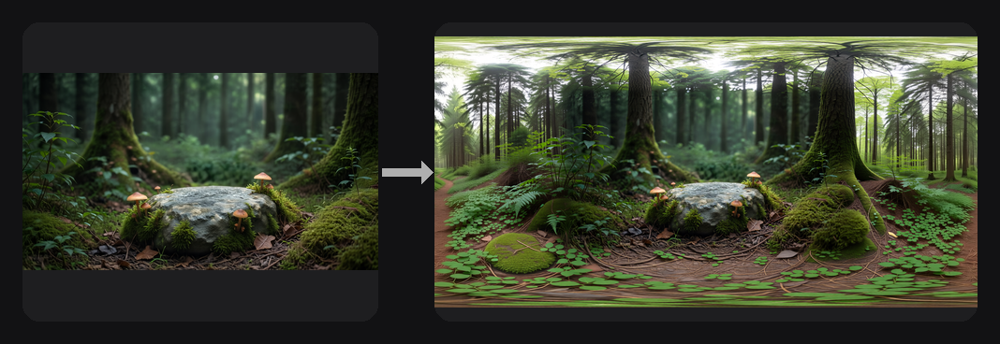
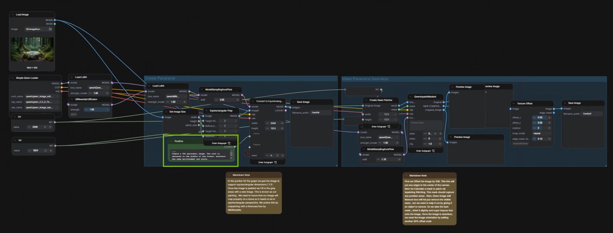
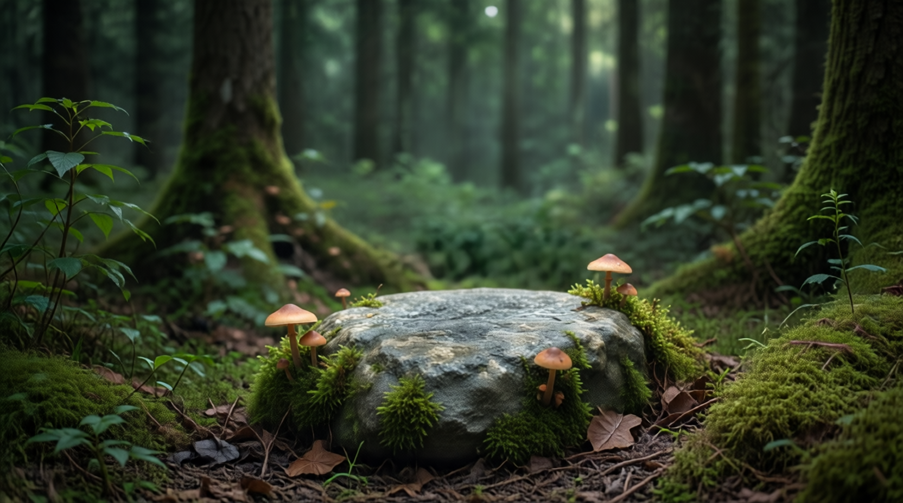
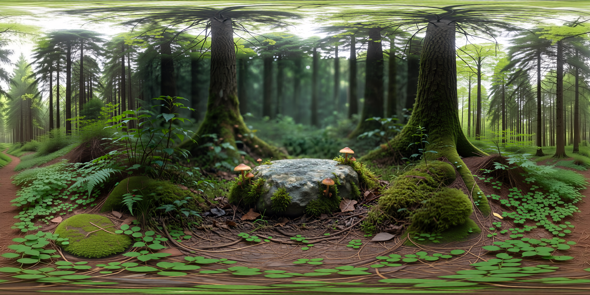

<!-- SPDX-FileCopyrightText: Copyright (c) 2026 NVIDIA CORPORATION & AFFILIATES. All rights reserved. -->
<!-- SPDX-License-Identifier: Apache-2.0 -->

# 06 — Image to Equirectangular Panorama


## Overview

This workflow turns a single image into a seamless equirectangular panorama for spherical mapping. Equirectangular images require a very specific perspective, so we combine outpainting with LoRAs to extend the scene correctly, then use targeted inpainting to remove seams. This is also the prerequisite for Module 07 (Panorama to HDRI).

## The Problem It Solves

Creating extended, seamless panoramas from a single image is challenging and often produces inconsistent results. By combining 360-degree LoRAs, outpainting, and targeted inpainting, you can build a fully immersive wrap-around environment suitable for 3D exploration.

## Key Features

- **LoRA-Driven Perspective Control:** Generates an accurate equirectangular panorama ready for spherical mapping.
- **Generative Image Editing:** Extends image boundaries and removes visible seams.
- **3D-Ready Output:** Clean wrap-around environment for lighting, scene design, and immersive workflows.

## How It Works

```
Input Image -> Pad for Outpainting -> LoRA -> Diffusion Model -> Inpainting -> Seamless Output
```

## ComfyUI Canvas



## Requirements

| Requirement | Value |
|-------------|-------|
| **VRAM (Minimum)** | 16 GB |
| **VRAM (Recommended)** | 24 GB |
| **Custom Nodes** | 5 packages |
| **Models** | 5 files + 1 gated LoRA |
| **Disk Space** | ~61 GB |

## Required Models

| Model | Type | Size |
|-------|------|------|
| `qwen_image_edit_2511_bf16.safetensors` | Image Edit Model | ~41 GB |
| `qwen_2.5_vl_7b.safetensors` | Text Encoder | ~17 GB |
| `qwen_image_vae.safetensors` | VAE | ~255 MB |
| `Qwen-Image-Lightning-8steps-V2.0.safetensors` | LoRA | ~1.7 GB |
| `Qwen-Image-Edit-2511-Object-Remover.safetensors` | LoRA | 225 MB |
| `MikMumpitz360.safetensors` | LoRA | 282 MB |

## Required Custom Nodes

- [ComfyUI-TextureAlchemy](https://github.com/amtarr/ComfyUI-TextureAlchemy) (Sandbox branch)
- [ComfyUI-WJNodes](https://github.com/807502278/ComfyUI-WJNodes)
- [ComfyUI-Easy-Use](https://github.com/yolain/ComfyUI-Easy-Use)
- [ComfyUI-KJNodes](https://github.com/kijai/ComfyUI-KJNodes)
- [ComfyUI-Inpaint-CropAndStitch](https://github.com/lquesada/ComfyUI-Inpaint-CropAndStitch)

## Example Output

| Input Image | Equirectangular Panorama |
|-------------|--------------------------|
|  |  |

## Sample Input

A sample input image is provided in the `input/` folder.

## How to Use

1. Load `06-image-to-equirectangular.json` into ComfyUI
2. Connect your input image and click **Queue Prompt**

## Troubleshooting

### Seam visible in panorama
Use the CropAndStitch node's feather setting to soften the join. A seam feather of 32–64 px typically eliminates the seam at standard panorama widths.

### Left/right edges don't align
The panorama outpainting requires the input image to be cropped to a 2:1 aspect ratio. Adjust the crop in the workflow before running.

### Object Remover LoRA not loading
Check that `Qwen-Image-Edit-2511-Object-Remover.safetensors` exists in `models/loras/qwen/`. Re-run `install.bat / install.sh --modules 06` to re-download.
