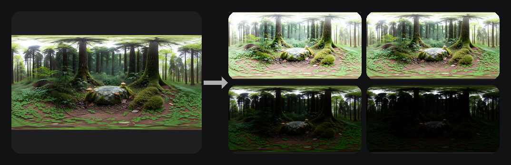
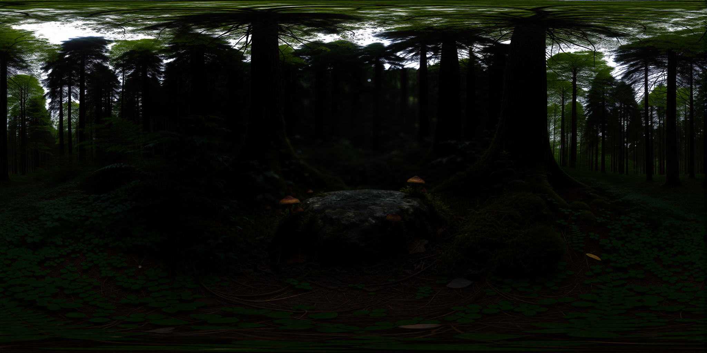

<!-- SPDX-FileCopyrightText: Copyright (c) 2026 NVIDIA CORPORATION & AFFILIATES. All rights reserved. -->
<!-- SPDX-License-Identifier: Apache-2.0 -->

# 07 — Panorama to HDRI


## Required Gated Models  

Module 7 contains a gated model. Flux.1-dev requires a HuggingFace login and acceptance of the [Black Forest Labs license](https://huggingface.co/black-forest-labs/FLUX.1-dev) for commercial use because The Flux VAE (`ae.safetensors`) is gated. The install script will prompt and wait for you to accept their terms. Run `hf login` and accept the Black Forest Labs license.

## Overview

This workflow converts a panoramic equirectangular image into a true HDRI for lighting in 3D engines, VFX, and PBR workflows. We generate multiple exposure stops using a curated library of LoRAs, then combine them using a custom luminance-stacking node system to produce an HDR environment map ready for use as an IBL in Unreal, Cycles, V-Ray, Arnold, and more.

## The Problem It Solves

Creating a real HDRI traditionally requires specialized equipment — a mirror ball, a professional camera capable of bracketed exposures, and a physical environment to capture. This workflow offers a fast alternative: generate exposure-bracketed panoramas from a single image and assemble them into a production-ready HDRI.

## Key Features

- **Multi-LoRA Branching:** Uses several LoRAs to generate reliable exposure stops.
- **HDR Assembly Pipeline:** Stacks multiple AI-generated exposures into a single HDRI.
- **Production-Ready Output:** Suitable for lighting in any major 3D engine.

## How It Works

```
Panoramic Image -> Four LoRAs -> Four Exposure Passes -> Luminance Stack -> HDRI (IBL)
```
## How to Use

1. Complete [Module 06](../06-equirectangular-outpainting/) to generate your panorama
2. Open `07-panorama-to-hdri` from the ComfyUI Template Browswer or Workflow Browser
3. Connect your panorama and click **Run**
   
## Sample Input

Run [Module 06](../06-equirectangular-outpainting/) first to generate a panorama, or use a sample from `input/`.

## Example Output

| Input Panorama | EV-4 | EV-2 | EV+2 | EV+4 |
|----------------|------|------|------|------|
|  |  |  |  |  |


## ComfyUI Canvas


## Requirements

| Requirement | Value |
|-------------|-------|
| **VRAM Min. Rec. Windows** | 24 GB |
| **VRAM Min. Rec. Linux** | 32 GB |
| **Custom Nodes** | 4 packages |
| **Models** | 9 files |
| **Disk Space** | ~23 GB |

## Required Models

| Model | Type | Size |
|-------|------|------|
| `flux1-dev-kontext_fp8_scaled.safetensors` | Image Model | 11.09 GB |
| `ViT-L-14-TEXT-detail-improved-hiT-GmP-HF.safetensors` | Text Encoder | 888 MB |
| `t5xxl_fp16.safetensors` | Text Encoder | 9.12 GB |
| `ae.safetensors` | VAE | ~340 MB |
| `Flux1DevTurbo.safetensors` | LoRA | ~500 MB |
| `evminus4.safetensors` | LoRA | 328 MB |
| `evminus2.safetensors` | LoRA | 328 MB |
| `evplus2.safetensors` | LoRA | 328 MB |
| `evplus4.safetensors` | LoRA | 328 MB |

## Required Custom Nodes

- [ComfyUI-TextureAlchemy](https://github.com/amtarr/ComfyUI-TextureAlchemy) (Sandbox branch)
- [ComfyUI-WJNodes](https://github.com/807502278/ComfyUI-WJNodes)
- [ComfyUI-Marigold](https://github.com/kijai/ComfyUI-Marigold)
- [Luminance-Stack-Processor](https://github.com/sumitchatterjee13/Luminance-Stack-Processor)


## Troubleshooting

### Flux VAE download fails with 401/403
The Flux VAE (`ae.safetensors`) is gated. Run `hf login` and accept the Black Forest Labs license at https://huggingface.co/black-forest-labs/FLUX.1-dev before or while running the installer.

### ComfyUI-Marigold import error / numpy
The installer patches Marigold for numpy 2.0 compatibility automatically. If you installed Marigold manually via Manager, apply the patch: in `ComfyUI-Marigold/nodes.py`, replace `.tostring()` with `.tobytes()`.

### Run Module 06 first
This module expects a panoramic equirectangular image as input. Run Module 06 to generate one, or use your own 2:1 aspect ratio panorama.
