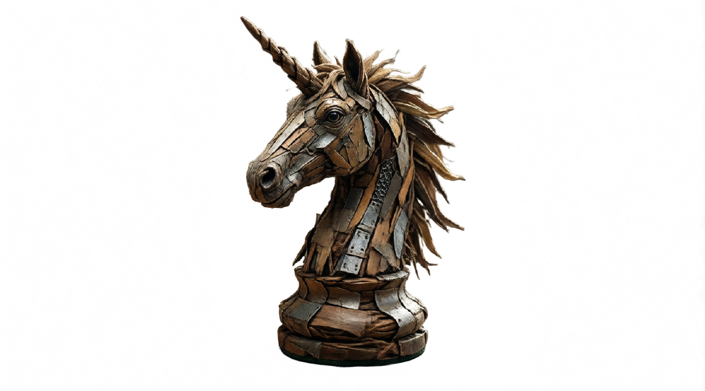

<!-- SPDX-FileCopyrightText: Copyright (c) 2026 NVIDIA CORPORATION & AFFILIATES. All rights reserved. -->
<!-- SPDX-License-Identifier: Apache-2.0 -->

# 08 — Trellis2 3D Asset Generation


## Overview

This workflow converts image references into usable 3D assets with PBR materials using Trellis2. Generated assets work well as starting meshes, stand-ins for previs, or structural anchors for reframing — especially when combined with Module 04 (Image to Gaussian Splat).

## Key Features

- **Image-to-3D Conversion:** Optimal settings for generating textured 3D assets from a single reference image.
- **PBR-Ready Output:** Produces models with materials suitable for modern rendering pipelines.
- **Flexible Use Cases:** Ideal for previs, layout, blocking, or as geometry foundations for further generative workflows.

## How It Works

```
Image -> Trellis2 -> 3D Model with PBR Materials
```

## Requirements

| Requirement | Value |
|-------------|-------|
| **VRAM (Minimum)** | 16 GB |
| **VRAM (Recommended)** | 24 GB |
| **Custom Nodes** | 2 packages |
| **Models** | 3 files (~20 GB total) |

## Required Models

| Model | Size |
|-------|------|
| `microsoft/TRELLIS.2-4B` | ~16 GB |
| `facebook/dinov3-vitl16-pretrain-lvd1689m` | ~1 GB |
| `microsoft/TRELLIS-image-large` | ~3 GB |

Pre-download before running:

```bash
python download_models.py --comfyui C:\path\to\ComfyUI --modules 08
```

## Required Custom Nodes

- [ComfyUI-Trellis2](https://github.com/visualbruno/ComfyUI-Trellis2)
- [zsq_prompt](https://github.com/windfancy/zsq_prompt)

## Sample Input

A sample input image is provided in the `input/` folder.

## How to Use

1. Load `workflow.json` into ComfyUI
2. Connect your reference image and click **Queue Prompt**
