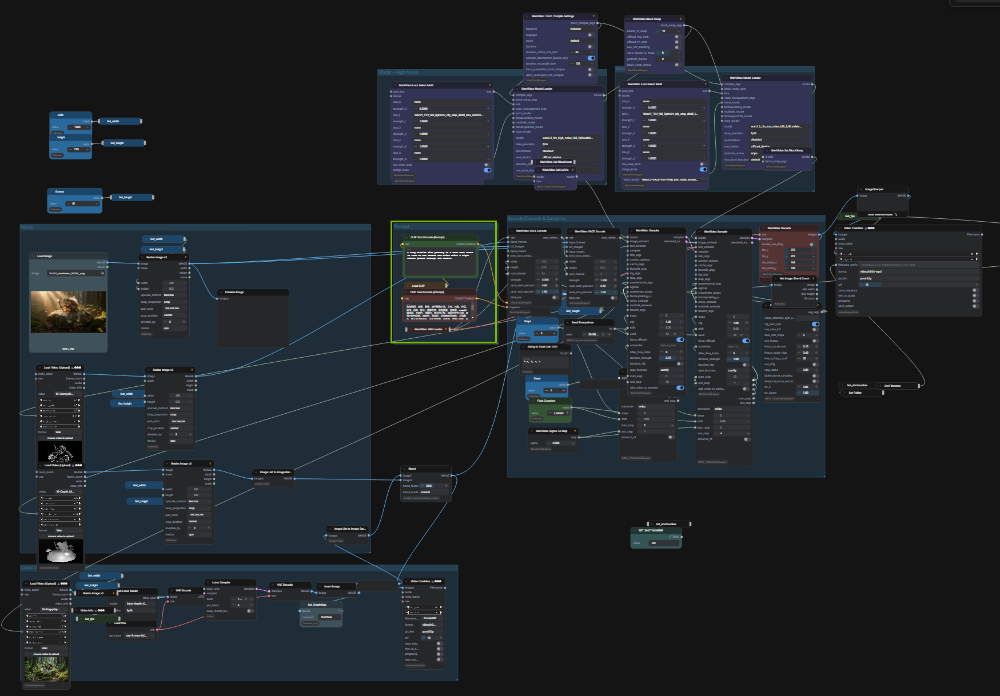

<!-- SPDX-FileCopyrightText: Copyright (c) 2026 NVIDIA CORPORATION & AFFILIATES. All rights reserved. -->
<!-- SPDX-License-Identifier: Apache-2.0 -->

# 10 — Playblast to Video


## Overview

This workflow turns a basic 3D render into a fully realistic and coherent video using Wan2.2 Vid2Vid, while keeping strong control over structure and motion. Export Depth and Canny/Edges passes from any 3D package to lock in geometry and silhouettes, then use a single style image to drive the look consistently across the entire sequence.

## The Problem It Solves

Turn any basic render (flat shading, no textures, simple lighting) that contains the correct motion and framing into a higher-quality visual. Fast style exploration: test multiple art directions by swapping the reference image, without re-animating or re-rendering the 3D shot.

## Key Features

- **3D-Locked Structure:** Depth preserves spatial layout, scale, and camera perspective.
- **Silhouette and Detail Control:** Canny/Edges keep contours sharp and reduce deformation.
- **Single-Image Style Anchoring:** A style frame provides consistent palette, materials, and rendering language.
- **Production-Friendly Iteration:** Swap reference images to explore looks while keeping the same motion and structure.

## How It Works

```
3D Render -> Depth Pass + Canny Pass -> Style Image -> Wan Vid2Vid -> Stylized Video Output
```

## How to Use

1. Export Depth and Canny passes from your 3D package
2. Open `10-video-to-video` from the ComfyUI Template Browswer or Workflow Browser
3. Connect your render passes and style image, then click **Run**

## Sample Input

Sample render frames and video passes are provided in the `input/` folder.

## ComfyUI Canvas

  
Green box indicates a prompt box.

## Requirements

| Requirement | Value |
|-------------|-------|
| **VRAM Min. Rec. Windows** | 32 GB |
| **VRAM Min. Rec. Linux** | 48 GB |
| **Custom Nodes** | 9 packages |
| **Models** | 9 files |
| **Disk Space** | ~143 GB |

## Required Models

| Model | Type | Size |
|-------|------|------|
| `Wan2.2-VACE-Fun-A14B_high_noise_model.safetensors` | Diffusion Model | ~37 GB |
| `Wan2.2-VACE-Fun-A14B_low_noise_model.safetensors` | Diffusion Model | ~37 GB |
| `wan2.2_t2v_high_noise_14B_fp16.safetensors` | Diffusion Model | ~28 GB |
| `wan2.2_t2v_low_noise_14B_fp16.safetensors` | Diffusion Model | ~28 GB |
| `wan_2.1_vae.safetensors` | VAE | 242 MB |
| `vae-ft-mse-840000-ema-pruned.safetensors` | VAE | 335 MB |
| `umt5_xxl_fp16.safetensors` | Text Encoder | 10.59 GB |
| `Wan21_T2V_14B_lightx2v_cfg_step_distill_lora_rank32.safetensors` | LoRA | ~500 MB |
| `lotus-depth-d-v-1-1-fp16.safetensors` | Depth Model | ~1.5 GB |

## Required Custom Nodes

- [ComfyUI-WanVideoWrapper](https://github.com/kijai/ComfyUI-WanVideoWrapper)
- [ComfyUI-Lotus](https://github.com/kijai/ComfyUI-Lotus)
- [ComfyUI-KJNodes](https://github.com/kijai/ComfyUI-KJNodes)
- [ComfyUI-Custom-Scripts](https://github.com/pythongosssss/ComfyUI-Custom-Scripts)
- [ComfyUI-VideoHelperSuite](https://github.com/Kosinkadink/ComfyUI-VideoHelperSuite)
- [cg-use-everywhere](https://github.com/chrisgoringe/cg-use-everywhere)
- [radiance](https://github.com/fxtdstudios/radiance)
- [comfyui-rtx-simple](https://github.com/BetaDoggo/comfyui-rtx-simple)
- [ComfyUI-Impact-Pack](https://github.com/ltdrdata/ComfyUI-Impact-Pack)

## Troubleshooting

### TritonMissing error during generation
In the `WanVideoSampler` node, set `torch_compile_args` to disabled/off. This is a known limitation of ComfyUI Portable's embedded Python on Windows — Triton is unavailable. Generation speed is unaffected for most GPUs.

### Out of memory on 24 GB VRAM
Enable maximum CPU offload in the ComfyUI-WanVideoWrapper settings. Module 10 was developed on A100-class hardware; full-resolution generation on 24 GB requires CPU offloading. RTX PRO 6000 (96 GB) is the recommended GPU for comfortable full-resolution generation.

### Depth extraction looks wrong
Ensure your render exports a proper depth pass (linear depth, not gamma-corrected). Canny/edge pass should use the silhouette render, not the final composite.

### Generation is very slow
At 24 GB with max CPU offload, expect 10–25 minutes for a short sequence. Use fewer frames or reduce resolution to speed up iteration.
